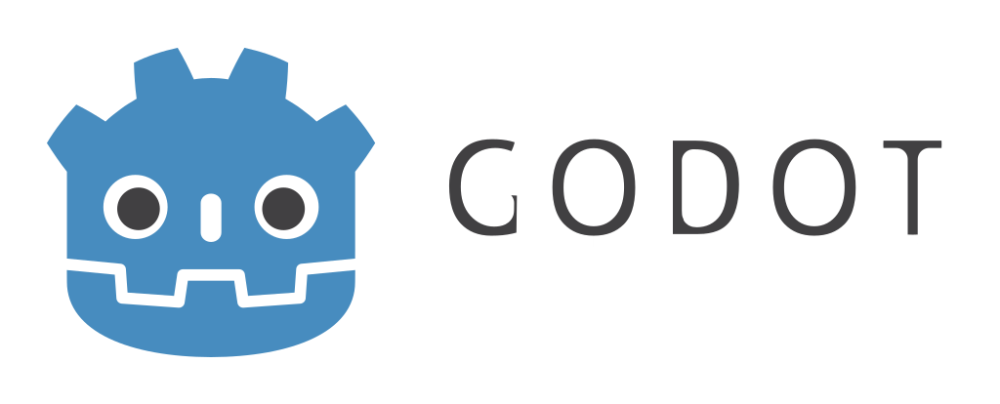

# Godot Engine - Riteo Edition

  

## What?
This is my own fork of [Godot Engine](https://godotengine.org), a
cross-platform 2D and 3D game engine. Here I'll put all the
patches that I use in my projects. As of now there isn't a lot of
stuff yet, but I'll slowly add whatever I'll find useful.
Other branches are usually PRs.

## Obtaining the engine
As now you can only compile it from source.
For instructions on how to build it, check out the
[official documentation](https://docs.godotengine.org/en/latest/development/compiling/).

## Contributing
If for some weird reason you want to contribute with some fix go
ahead, but I probably won't accept feature requests, since this
is my own version with the things I want on it.
If you want to extend it, feel free to fork it instead.
